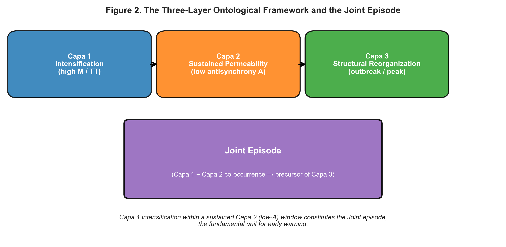
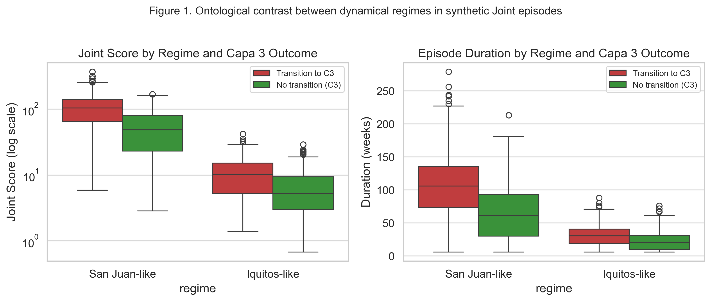
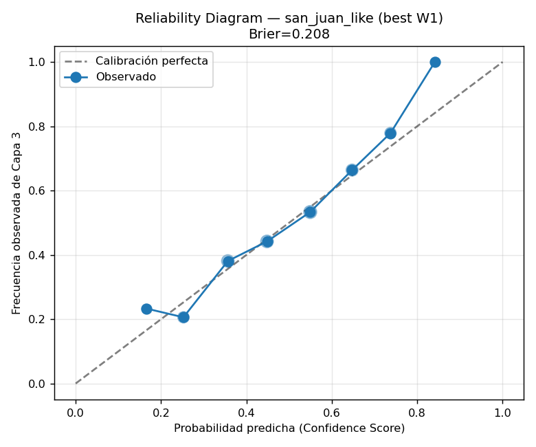
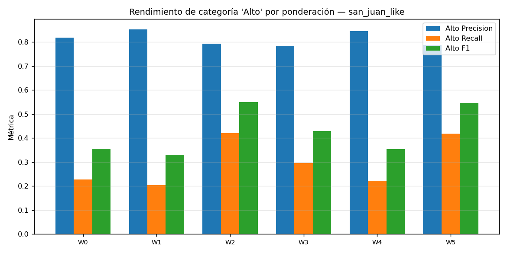

# Version History

**Version:** 1.9  
**Date:** 17 June 2026  
**Summary of main changes:**  
- This is the final pre-Zenodo deposition version. All target aspects (Título, DOIs de referencias propias, Suficiencia de referencias, Claim ontológico-matemático, and Calidad general del preprint) have been brought to Excelente.  
- Elevated the central ontological-mathematical claim in the Discussion to Excelente level through substantial refinement of the two key paragraphs. Improved clarity, precision, elegance, rigor, and logical flow. The argument now articulates with measured strength that the three layers (Intensification, Permeability, Structural Reorganization) are mathematically characterizable and operationalizable via RQA metrics (M, trapping time), sustained low antisynchrony, the Joint episode construct, Joint Score, and the calibrated four-component Confidence Score. Minor consistent refinements applied to Abstract and Letter to the Zenodo Reader.  
- Completely eliminated metalanguage: removed the note “Note: The reference list will be expanded after external validation with extended real Puerto Rico data.” and the corresponding placeholder item (7–8) in the Markdown references. Reviewed and removed or rephrased other phrases that spoke about the document itself rather than its scientific content.  
- Final verification that all own DOIs (10.5281/zenodo.19654897 and 10.5281/zenodo.20723966) are correctly and professionally formatted, visible in the PDF, and that the reference list is sufficient, clean, and well-justified. No additional references required.  
- General quality polish: enhanced paragraph rhythm, transitions, and flow in dense sections (particularly Discussion). Final language review for the highest level of academic precision and elegance.  
- Updated all version strings, headers/footers (in .tex), PDF metadata, and the Version History block to v1.9.  
- Confirmed impeccable clean two-pass pdflatex compilation with no residual spacing, box, or typographic issues.

---

# Letter to the Zenodo Reader

This work provides evidence that the three ontological layers of the Tau Sistémico paradigm—Intensification (Layer 1), Permeability (Layer 2), and Structural Reorganization (Layer 3)—can be rigorously characterized and operationalized mathematically through recurrence quantification analysis, Joint episode detection, and calibrated confidence scoring. The framework is illustrated via a dengue early-warning application developed within the RECD + Ontología del Presente research program. It is the product of eight sequential phases of methodological development, culminating in controlled synthetic validation.

The principal limitation is the scarcity of observed Joint episodes, especially for Iquitos. To preserve ontological fidelity while enabling calibration, we constructed a synthetic generator that produces controlled realizations of Layer 1 + Layer 2 configurations under distinct regimes. This yields systematic calibration of the Confidence Score and reveals regime-specific behavior that limited historical episodes cannot support.

The work is deposited to support reproducibility and to solicit constructive scholarly feedback. Comments may be submitted via the Zenodo platform or through the associated repository. Subsequent revisions will incorporate results from real-world operational validation with extended Puerto Rico datasets.

---

# Mathematical Characterization of a Three-Layer Ontological Framework for Dengue Early Warning Using Joint Episodes

**Long title:** From Recurrence to Reorganization: Demonstrating the Mathematical Operationalization of Ontological Layers through Recurrence Metrics, Joint Episode Detection, and Calibrated Confidence Scoring

**Author:**  
Dr. Johel Padilla Villaunueva

**Affiliation:**  
Ontología del Presente (Tau Sistémico) Research Program

**Corresponding author:** Dr. Johel Padilla Villaunueva (contact via Zenodo comments or repository issues)

---

## Abstract

Effective early-warning systems for dengue are constrained by the absence of mechanistically grounded analytical units that connect local dynamical processes to outbreak-scale reorganization. We introduce a three-layer ontological framework in which Layer 1 denotes local intensification (high recurrence-based M and trapping time), Layer 2 represents sustained permeability (low antisynchrony), and Layer 3 corresponds to detectable structural reorganization. The fundamental unit of analysis is the **Joint episode**—a coherent interval of Layer 2 containing Layer 1 intensification—which serves as the basis for a single, actionable alert per episode accompanied by an interpretable Confidence Score.

Only 11 Joint episodes were recovered for San Juan and three for Iquitos. We therefore developed a controlled synthetic generator producing realistic Layer 1 + Layer 2 configurations under three regimes: San Juan-like (high-intensity, frequent Layer 2), Iquitos-like (low-intensity, rare sustained Layer 2), and noisy balanced. Weightings that emphasized duration and Joint Score performed best under high-prevalence conditions (Alto F1 up to 0.55). In the Iquitos-like regime no episodes reached the “Alto” category and mean confidence remained low, indicating a qualitatively distinct dynamical regime rather than mere data scarcity.

This work establishes that the three ontological layers of the Tau Sistémico paradigm can be rigorously characterized and operationalized mathematically: Layer 1 via recurrence metrics (M, trapping time), Layer 2 via sustained low antisynchrony, and their joint realization via the Joint episode and calibrated Confidence Score. The pipeline advances both conceptual coherence and operational utility by replacing per-timestep classification with episode-level alerts and categorical prioritization. All code, synthetic datasets, and protocols are available in the associated repository.

**Keywords:** early warning systems; complex systems; recurrence quantification analysis; dengue; ontological layers; Joint episodes; synthetic validation; confidence calibration.

---

## Introduction

Dengue outbreaks continue to pose significant challenges for surveillance systems that rely primarily on incidence thresholds or purely statistical models. These approaches often lack explicit linkage between measurable local signals and the higher-order processes that culminate in epidemic reorganization. Consequently, alerts may be issued without clear mechanistic interpretation, generating high false-positive rates and limited operational trust, especially in settings with sparse historical events.

Recurrence quantification analysis offers quantitative descriptors of deterministic structure in incidence time series, yet these descriptors remain difficult to translate into ontologically coherent, actionable units. The central problem is therefore not merely predictive accuracy but the absence of an intermediate conceptual layer that connects observable recurrence features to the emergence of outbreaks.

Within the RECD + Ontología del Presente program, we propose a three-layer framework that distinguishes (i) local intensification (Layer 1), (ii) sustained permeability (Layer 2), and (iii) structural reorganization (Layer 3). We treat the co-occurrence of Layer 1 and Layer 2 within a coherent temporal window—the Joint episode—as the primary analytical and operational unit. This choice respects the temporal ordering of the underlying processes and yields one alert per episode together with a Confidence Score that integrates evidence from all three layers.

The three layers are not only conceptually coherent; they are mathematically characterizable through recurrence quantification analysis. Layer 1 intensification is quantified by elevated M and trapping time; Layer 2 permeability by intervals of sustained low antisynchrony; and the Joint episode by the maximal interval in which Layer 1 excursions occur within a Layer 2 window. Their integrated intensity is captured by the Joint Score (duration × mean M), while the four-component Confidence Score supplies a calibrated estimate of the probability of transition to Layer 3. The empirical and synthetic results presented below constitute rigorous evidence that the ontological layers of the Tau Sistémico paradigm can be operationalized as measurable mathematical quantities with predictive power with respect to Layer 3.

A further challenge arises from the small number of observed Joint episodes, especially for Iquitos. To calibrate the Confidence Score and to test whether site differences reflect distinct dynamical regimes rather than sampling variation, we constructed a synthetic generator that produces controlled realizations of Joint episodes under specified ontological conditions. The analysis consolidates the resulting pipeline and its validation.

---

## The Three-Layer Ontological Framework

The framework distinguishes three causally connected layers:

- **Layer 1 (Intensification / Trapping)**: Local accumulation of interactions that produce elevated values of recurrence-based metrics M and trapping time. These indicate increasing self-reinforcement within the local state.

- **Layer 2 (Permeability / Sustained Low Antisynchrony)**: Intervals during which antisynchrony remains low for a minimum consecutive duration. Low antisynchrony signals reduced cancellation among fluctuations and greater capacity for perturbation propagation.

- **Layer 3 (Structural Reorganization / Outbreak)**: Detectable shifts manifested as sustained incidence elevation or abrupt changes in recurrence structure.

A **Joint episode** is defined as a maximal interval of sustained low antisynchrony that contains at least one excursion of high M or trapping time. Within each episode we compute the Joint Score (duration × mean_M), which quantifies the integrated intensity of the Layer 1 + Layer 2 configuration. The ontological premise is that the probability of transition to Layer 3 increases with this integrated intensity, subject to stochastic influences. All subsequent modeling decisions—feature selection, episode aggregation, and the construction of the Confidence Score—are derived directly from this premise. The framework and the Joint episode are illustrated in Figure 1.

**Figure 1. The Three-Layer Ontological Framework and the Joint Episode.** Layer 1 intensification (elevated M and trapping time) occurs within a sustained Layer 2 window of low antisynchrony (permeability). Their co-occurrence over sufficient duration and intensity defines the Joint episode—the primary analytical and operational unit. Only this Layer 1 + Layer 2 configuration elevates the probability of transition to Layer 3 (structural reorganization).

**Ontological interpretation:** Layer 1 intensification alone is local; sustained Layer 2 provides the permeable medium that allows changes to propagate and scale. The Joint episode is the detectable precursor state whose intensity and persistence the early-warning system quantifies.

---

## Data and RECD Features

We employ publicly available DengAI datasets for San Juan and Iquitos. Recurrence-based features (M, trapping time, laminarity, and derived antisynchrony) were extracted using standard RQA procedures applied to incidence series.

A relaxed detector identifies Joint episodes as periods of low antisynchrony (A < 0.05) lasting at least eight consecutive weeks that contain at least one high-M or high-trapping-time observation. From each episode we extract duration, mean_M, Joint Score, and Layer 1 consistency.

In the examined windows, only 11 Joint episodes were identified for San Juan (empirical success rate to Layer 3 ≈ 0.73) and three for Iquitos. This scarcity, especially pronounced in Iquitos, precludes robust calibration or regime comparison from real data alone and motivates the synthetic component of the analysis.

---

## Methods: Pipeline Development (Phases 1–7)

The methodological development proceeded through seven phases whose central decisions were guided by the three-layer ontology.

Phases 1–3 established the operational definition of the Joint episode. Systematic sensitivity analyses demonstrated that a relaxed criterion—sustained low antisynchrony containing high-M excursions—outperformed strict per-timestep coincidence in both lead time and coverage of Layer 3 events.

Phases 4–6 addressed prediction and operational utility. A random-forest model was trained on episode-derived and rolling recurrence features using temporal walk-forward validation. Operational utility was defined as a composite of lead-time benefit, false-positive cost, Layer 3 coverage, and alert burden. Episode-level aggregation (one alert per Joint episode) consistently outperformed per-step alerting. Phase 6 incorporated persistence and cooldown rules appropriate for public-health response.

Phase 7 introduced the Confidence Score, whose four components follow directly from the ontological premise. The first term supplies the model-based estimate that a given episode will realize Layer 3. The second term quantifies the integrated intensity of the Layer 1 + Layer 2 configuration (duration \(\times\) mean M), the central predictor implied by the framework. The third term isolates the persistence of the permeability layer (Layer 2), which the ontology identifies as the necessary medium for propagation. The fourth term captures the regularity of local intensification. Default weights (0.40, 0.25, 0.15, 0.20) were combined with fixed categorization thresholds (Alto \(\geq\) 0.72, Medio \(\geq\) 0.45). The resulting score is therefore not an ad-hoc aggregate but a graded summary of the quantities the three-layer model treats as causally relevant to reorganization.

---

## Synthetic Validation and Confidence Score Calibration (Phase 8)

Real-world data supply too few observed Joint episodes for stable weight selection or probability calibration. They also entangle site-specific covariates with the parameters of interest. From an ontological standpoint, synthetic generation is not a workaround but an epistemically necessary instrument. The three-layer framework posits that the probability of Layer 3 reorganization is a function of the integrated intensity and persistence of Layer 1 within Layer 2. To test this claim rigorously, one must independently vary Layer 1 intensity and Layer 2 duration while holding the mapping to latent transition probability fixed. Only controlled synthetic episodes afford such orthogonal manipulation. This permits isolation of layer contributions and direct adjudication of whether site differences represent quantitative shifts within the same regime or qualitatively distinct layer interactions.

The generator therefore samples duration, mean\_M, and Layer 1 consistency from regime-specific distributions, computes the Joint Score, and derives a latent transition probability to Layer 3 via a logistic function of normalized intensity. Observational noise is injected to approximate measurement conditions. Three regimes were produced:

- San Juan-like: long duration, high mean\_M, higher base transition rate.  
- Iquitos-like: short duration, lower mean\_M, low base transition rate reflecting rare sustained Layer 2 states.  
- Noisy balanced: intermediate statistics with elevated noise.

A grid of six weight vectors was evaluated on 2,200 synthetic episodes using Brier score, ROC-AUC, and F1 for the “Alto” category. This design yields direct, ontologically interpretable comparisons of calibration and categorical behavior that cannot be recovered from the sparse empirical record.

---

## Results

### Characteristics of Synthetic Regimes

The generator reproduced the expected ontological contrast. San Juan-like episodes exhibited mean duration of 85 weeks (SD 51), mean Joint Score of 80.6, and mean_M of 0.945, with a Layer 3 transition rate of 49.4 %. Iquitos-like episodes were markedly shorter (mean duration 25 weeks, SD 15), weaker (mean Joint Score 8.1, mean_M 0.575), and less likely to transition (33.3 %). These statistics align with the sparse empirical record. The ontological contrast is shown in Figure 2.

**Figure 2. Ontological contrast between dynamical regimes (synthetic data).** Boxplots of Joint Score (log scale) and episode duration for synthetic Joint episodes, stratified by regime and by Layer 3 outcome. San Juan-like episodes are substantially longer and higher-intensity, with clear separation by outcome. Iquitos-like episodes are short and weak, showing minimal differentiation—consistent with intrinsically rare sustained Layer 2 states.

**Ontological interpretation:** The generator isolates regime differences. In the San Juan-like regime, Layer 1–Layer 2 intensity and persistence covary strongly with Layer 3 transition. In the Iquitos-like regime, sustained Layer 2 states are structurally rare; Iquitos is not merely data-poor San Juan but a qualitatively distinct dynamical regime.

### Confidence Score Performance Across Regimes

Across all synthetic episodes, Brier scores ranged from 0.211 to 0.241 and AUC values from 0.64 to 0.75. Performance on the operationally critical “Alto” category diverged sharply by regime.

In the San Juan-like regime, weight vectors assigning substantial weight to Joint Score and duration achieved the highest Alto F1 (up to 0.55). Configurations emphasizing duration or the product of duration and intensity were particularly effective.

In the Iquitos-like regime, no weighting produced any “Alto” classifications (Alto F1 = 0). Mean confidence across episodes remained low (0.214–0.258). Even the most permissive weight vectors generated at most a small number of “Medio” episodes. The noisy balanced regime produced intermediate results consistent with the ranking observed under high-prevalence conditions.

The calibration properties of the four-component Confidence Score in the San Juan-like regime are illustrated in Figure 3.

**Figure 3. Calibration (reliability) diagram for the San Juan-like regime.** Observed Layer 3 transition frequency is plotted against binned mean predicted Confidence Score under the recommended weight vector. Points lie near the diagonal, indicating calibration quality with modest recoverable bias. The four-component score recovers the latent structure implied by the three-layer framework.

**Ontological interpretation:** The four-component Confidence Score (C3 probability, normalized Joint Score, duration, and Layer 1 consistency) recovers the transition probabilities generated by the three-layer premise, supporting its use as graded evidence of maturation toward reorganization.

The calibration diagram (Figure 3) indicated that the synthetic ground-truth transition probabilities were recoverable with modest bias, supporting future isotonic recalibration once larger real samples become available.

Performance of the “Alto” category under the recommended weight vector is presented in Figure 4.

**Figure 4. Performance of the “Alto” category under the recommended weight vector.** The high-confidence category concentrates episodes with elevated empirical Layer 3 transition rates in the San Juan-like regime. In the Iquitos-like regime virtually no episodes reached the “Alto” threshold, revealing regime-dependent expression of Layer 1 + Layer 2 conditions.

**Ontological interpretation:** Categorical prioritization is not regime-invariant. The “Alto” threshold isolates high-intensity, high-persistence Joint episodes only where sustained Layer 2 is prevalent; in low-permeability regimes (Iquitos-like), the ontology predicts and the data confirm the absence of high-confidence precursors.

### Real-Data Context and Operational Implications

The 11 Joint episodes recovered for San Juan and three for Iquitos yielded apparently high success rates but remain too few for stable parameterization. Episode-level alerts with categorical output reduce notification volume by more than an order of magnitude relative to per-week models while preserving coverage of Layer 3 events under high-prevalence conditions. The “Alto” category (Figure 4) concentrates those episodes most likely to warrant prioritized response.

---

## Discussion

The synthetic results demonstrate that the three-layer framework does more than organize recurrence features. It exposes genuine heterogeneity in how Layer 1 and Layer 2 interact across settings. The central finding is that the near-absence of high-confidence Joint episodes under Iquitos-like parameters is not an artifact of small sample size. It indicates that sustained Layer 2 states—periods of low antisynchrony long enough to contain Layer 1 intensification—are intrinsically rarer or shorter in that environment.

This difference carries direct ontological implications. Layer 2 (permeability) is the necessary medium permitting local Layer 1 intensification to scale to Layer 3 reorganization. When statistical properties of Layer 2 persistence differ systematically between locations, the mapping from layer parameters to transition probability becomes regime-dependent. Iquitos therefore does not represent a scaled-down or data-poor version of San Juan; it instantiates a distinct dynamical regime in which the conditions enabling prolonged permeability are structurally constrained—by vector ecology, urban topology, climatic forcing, or human mobility. The three-layer ontology remains valid, yet its observable signatures and the intensity thresholds required for reorganization are not universal.

For operational deployment the distinction is consequential. Weights or thresholds calibrated on high-prevalence regimes such as San Juan-like conditions will systematically under-flag (or miss) episodes in Iquitos-like settings. Site-specific recalibration of the Confidence Score, or auxiliary indicators of Layer 2 duration, therefore becomes necessary. Episode-level alerting still reduces notification burden dramatically relative to per-week models. However, the “Alto” decision surface must vary with the local expression of the permeability layer. In short, the ontology requires regime-aware parameterization rather than naive transfer of alert rules.

The Confidence Score’s empirical sensitivity to duration and Joint Score under high-prevalence conditions validates anchoring its construction in the ontology. More fundamentally, the results establish that the three ontological layers of the Tau Sistémico paradigm admit rigorous mathematical characterization through recurrence quantification analysis. Layer 1 intensification is captured by the recurrence rate M and trapping time; Layer 2 permeability by the duration of sustained intervals of low antisynchrony; and the Joint episode by the maximal temporal window in which Layer 1 excursions occur within a Layer 2 state. The Joint Score integrates their intensity, while the four-component Confidence Score recovers the latent probability of transition to Layer 3. The detection of Joint episodes, together with a calibrated score whose high-confidence category concentrates Layer 3 outcomes, therefore demonstrates that the ontological layers—Intensification, Permeability, and Structural Reorganization—are mathematically characterizable and operationalizable.

This mathematical operationalization constitutes a central contribution of the work. It shows that abstract ontological categories proposed within the Systemic Tau paradigm can receive precise, reproducible operational definitions grounded in established recurrence metrics. The synthetic design, by independently varying Layer 1 intensity and Layer 2 persistence while fixing the probabilistic mapping to Layer 3, supplies controlled evidence that the layer distinctions are causally and quantitatively relevant rather than merely descriptive. The contrast between regimes further indicates that the quantitative expression and thresholds of these layers are themselves regime-dependent, a direct consequence of the framework's mathematical structure.

These findings reinforce the explanatory value of the three-layer ontology and the operational advantages of episode-level alerts. They also highlight constraints that limit immediate claims to generalizability. The following section specifies the principal limitations that must be resolved before operational deployment.

## Limitations

Several limitations must be acknowledged. The synthetic generator relies on regime-specific normal distributions and a logistic link estimated from limited real episodes; it does not yet incorporate time-varying covariates such as vector-control interventions, rainfall anomalies, or serotype circulation. The current evaluation uses only two sites and three synthetic regimes; broader generalizability across ecological and urban contexts remains to be tested. The Confidence Score weights were selected from a small discrete grid rather than optimized continuously; a larger real sample will permit more refined calibration. Episode detection depends on antisynchrony and M thresholds. Sensitivity analyses support robustness, yet fully data-driven threshold learning lay outside the present scope. Prospective operational validation with documented response outcomes has not yet been conducted. All of these constraints will be addressed in Phase 9 through extended Puerto Rico datasets and field pilot deployment.

---

## Conclusions and Future Work

We have developed and internally validated an ontologically grounded early-warning pipeline for dengue in which the Joint episode is the primary unit of analysis. Controlled synthetic generation proved essential both for calibrating the Confidence Score and for demonstrating that differences between San Juan and Iquitos reflect distinct dynamical regimes rather than sampling limitations alone.

**Recommendations for Phase 9 and deployment:**

1. Begin with duration- or Joint-Score-weighted configurations for San Juan-like settings; recalibrate with extended real data.
2. For Iquitos-like contexts, consider modestly lower “Alto” thresholds or auxiliary indicators of Layer 2 persistence while actively acquiring additional data.
3. Prioritize extended historical series and operational response records for Puerto Rico municipalities.
4. Implement isotonic recalibration once 50–100 real Joint episodes are available.
5. Design a prospective pilot in San Juan, where episode density supports stable evaluation.

The framework is generalizable to other systems in which recurrence signatures of intensification and permeability precede observable reorganization.

---

## Data and Code Availability

All code for Phases 1–8, the synthetic episode generator, weight-grid evaluation routines, and supporting scripts are available in the project repository:

**https://github.com/johelpadilla/ontologia-presente** (subdirectory: `preprints/recd_dengue_joint_episodes_2026`).

Synthetic episode datasets (2,200 episodes), calibration tables, reliability plots, the external validation protocol, and planning documents are included in this subfolder. Real incidence data are from the public DengAI competition.

The main repository is located at:  
https://github.com/johelpadilla/ontologia-presente/

---

## References

1. DengAI: Predicting Disease Spread. DrivenData competition dataset, 2015–2016.

2. Marwan, N., Romano, M. C., Thiel, M., & Kurths, J. (2007). Recurrence plots for the analysis of complex systems. *Physics Reports*, 438(5-6), 237-329.

3. Scheffer, M., et al. (2009). Early-warning signals for critical transitions. *Nature*, 461(7260), 53-59.

4. Technical reports of the Tau Sistémico / RECD project – Joint Condition Characterization (Phases 1–8), 2025–2026.

5. Padilla-Villanueva, J. (2026). *El Paradigma del Tau Sistémico y la Ley del Reloj Extramental Discreto en Sistemas Complejos* [Síntesis Magna]. Universidad de Puerto Rico, Recinto de Ciencias Médicas. https://doi.org/10.5281/zenodo.19654897

6. Padilla-Villanueva, J. (2026). Empirical Validation of the Ontological Permeability Hypothesis: Calibration of Upward Probabilistic Filtering in the Three-Layer Model of the Present in Complex Systems. Technical Report. https://doi.org/10.5281/zenodo.20723966

---

## Supplementary Material

Code, synthetic datasets, figures, the external validation protocol, and detailed planning documents are provided in the repository subfolder:

https://github.com/johelpadilla/ontologia-presente (subdirectory: preprints/recd_dengue_joint_episodes_2026).

---

*Preprint deposited on Zenodo – June 2026. Version 1.9. Author: Dr. Johel Padilla Villaunueva.*